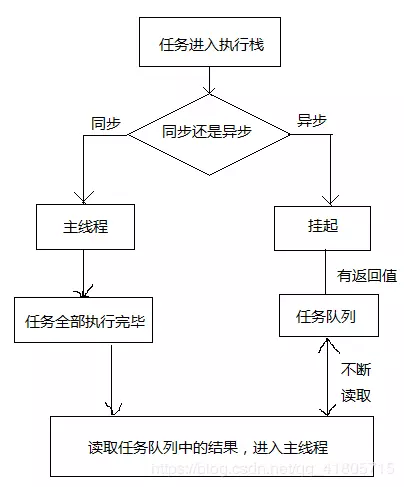
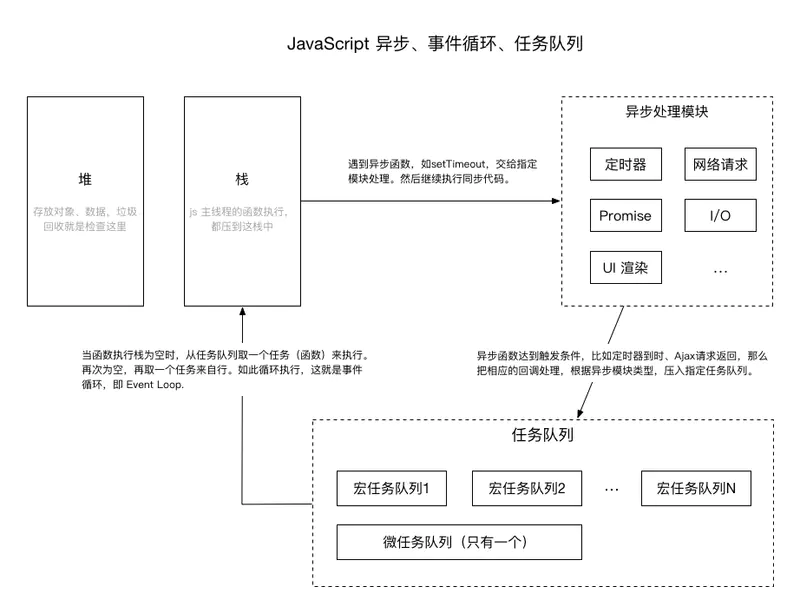

## 简介

Event Loop即事件循环，是解决JavaScript单线程运行阻塞的一种机制。

 ## 同步任务和异步任务

**同步任务：**同步任务在主线程上排队执行的任务，只有前一个任务执行完毕，才能执行后一个任务；

**异步任务：**异步任务不进入主线程、而进入"任务队列"（task queue）的任务，只有"任务队列"通知主线程，某个异步任务可以执行了，该任务才会进入主线程执行。 

<!--more-->

**注意：**

只有所有同步任务执行完毕，才会开始执行异步任务



## EventLoop

主线程从任务队列中不断循环读取事件，整个的这种运动机制称为EventLoop

**任务队列**：一个用于存储异步任务的回调函数一个容器。

 **异步处理模块（后台线程）：**当异步任务处理完毕之后，会将回调函数放入任务队列中，根据任务类型会被分别放入宏任务队列和微任务队列。

**主线程**：每当主线程执行栈中代码执行完毕之后，就会向任务队列读取一个任务。如此循环读取，就是事件循环。（先读取微任务队列，再读取宏任务队列）





## 宏任务和微任务

### 宏任务

由js的宿主环境发起的异步任务

|                       | 浏览器 | node |
| --------------------- | ------ | ---- |
| 同步代码              | √      | √    |
| UI rendering          | √      | √    |
| I/O                   | √      | √    |
| setTimeout            | √      | √    |
| setInterval           | √      | √    |
| requestAnimationFrame | √      | ×    |
| setmmediate           | ×      | √    |
| ajax                  | √      | ×    |

### 微任务

由js引擎自身发起的异步任务

|                      | 浏览器 | node |
| -------------------- | ------ | ---- |
| process.nextTick     | ×      | √    |
| Promises             | √      | √    |
| Object.observe(废弃) | √      | √    |
| MutationObserver     | √      | ×    |

### 任务优先级

微任务 > 宏任务 

```js
setTimeout(() => { console.log("1") }, 5000)
new Promise((res, rej) => {
    console.log(2)
    setTimeout(res,4900)
}).then(() => {
    setTimeout(() => { console.log("4") }, 5000)
    console.log(3)
})

/*
2
3
1
4
*/
```


## 一些问题

**为什么只有一个微任务队列而有多个宏任务队列？**

**GUI 渲染线程 和 JS 引擎线程  是互斥的？**

**有十个定时器或ajax是不是就新开十个线程呢？**

Ajax请求确实是异步的，这请求是由浏览器新开一个线程请求，事件回调的时候是放入Event loop单线程事件队列等候处理。 

**js主线程是将代码压入栈中执行，但栈是先进后出的，为什么前面的代码会先执行？**

见 执行栈

**当异步任务嵌套时如何处理？**

当异步任务A的回调中还有异步任务B时，需要等A的回调进入主线程，然后任务B将进入下一个循环

**任务队列中的任务是如何进入主线程的？**

**异步处理模块处理完成之后，是如何将回调放进任务队列的**？


